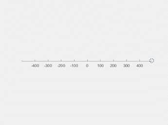
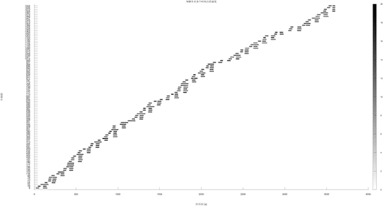
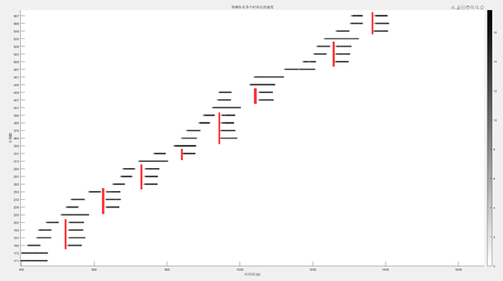
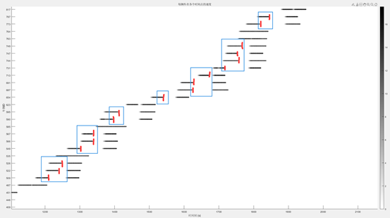
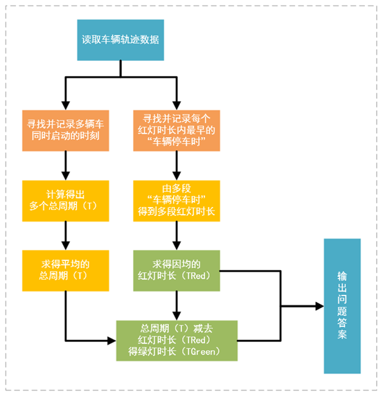
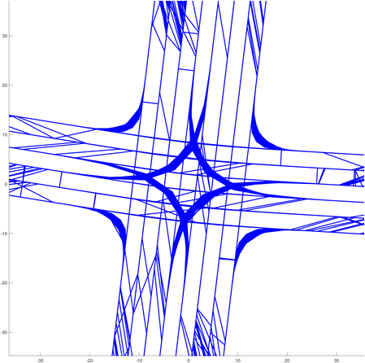

# 使用行车轨迹估计交通信号灯周期问题

> 研究问题见 [研究问题.md](./研究问题.md)（[原始赛题](./原始赛题/B题：使用行车轨迹估计交通信号灯周期问题.pdf)）
> 本文为研究结果的 Markdown 版，详见 [原始文件](./作答：使用行车轨迹估计交通信号灯周期问题.docx)

## 摘要

随着城市的发展，城市路网变得越来越复杂，但是鉴于许多地方的交通信号灯未接入网络，直接获取数据存在困难。所以某电子地图服务商旨在通过利用客户的行车轨迹数据，来估计城市路网中交通信号灯的红绿周期，以便为司机提升更好的导航服务。已知所有信号灯只有红、绿两种状态，我们需要解决四个问题。

在问题一中，信号灯的周期不变，已知经过路口的所有车辆的行驶轨迹，我们需要建立一个信号灯周期预测模型，利用所有车辆的行车轨迹来推算出各路口的红灯时长（秒）和绿灯时长（秒）。一共有5个不相关的路口，需要分别推测出5组数据。

在问题二中，由于考虑到实际情况，我们能捕获的车辆数据不可能覆盖到所有车辆，且在现实中已知的轨迹数据也可能受多种因素干扰，我们需要讨论模型推理的精度受干扰因素影响的大小，并优化预测模型，尝试预测出在能获取的数据具有局限性、且已知车辆数据受一定程度的干扰下，各路口的红灯时长（秒）和绿灯时长（秒）。一共有5个不相关的路口，需要分别推测出5组数据。

在问题三中，信号灯的周期是再是固定不变的，我们需要根据轨迹数据判断2个小时内信号灯的周期是否发生了改变。这里我们利用双向滑动窗口的技术对数据进行分析，检测出前后信号灯周期的变动，并确定了周期变化的具体时刻及其变化后的新周期。一共有6个不相关的路口，需要分别推测出6组数据。

在问题四中，我们将根据连续 2 小时内所有方向样本车辆的轨迹数据，对一个具体路口的交通信号周期进行推理识别。

**关键词**：周期预测；模式识别；傅里叶变换；模型优化；双向滑动窗口

## 目录

1. [问题重述](#1-问题重述)
   1. [问题背景](#11-问题背景)
   2. [问题提出](#12-问题提出)
2. [模型假设](#2-模型假设)
3. [符号说明](#3-符号说明)
4. [问题一模型的建立与求解](#4-问题一模型的建立与求解)
   1. [数据分析](#41-数据分析)
   2. [求解问题](#42-求解问题)
   3. [模式识别算法模型求解总述](#43-模式识别算法模型求解总述)
   4. [结果讨论](#44-结果讨论)
5. [问题二模型的建立与求解](#5-问题二模型的建立与求解)
   1. [数据分析](#51-数据分析)
   2. [求解问题](#52-求解问题)
   3. [傅里叶变换模型求解总述](#53-傅里叶变换模型求解总述)
   4. [结果讨论](#54-结果讨论)
6. [问题三模型的建立与求解](#6-问题三模型的建立与求解)
   1. [数据分析](#61-数据分析)
   2. [求解问题](#62-求解问题)
   3. [滑动窗口模型求解总述](#63-滑动窗口模型求解总述)
   4. [结果讨论](#64-结果讨论)
7. [问题四模型的建立与求解](#7-问题四模型的建立与求解)
   1. [数据分析](#71-数据分析)
   2. [求解问题](#72-求解问题)
8. [模型的总结](#8-模型的总结)
   1. [模型优点](#81-模型优点)
   2. [模型缺点](#82-模型缺点)

## 1 问题重述

### 1.1 问题背景

某电子地图服务商致力于改善其导航服务，想尽可能精确地获取城市各路口交通信号灯的红绿灯周期信息。但由于大多数信号灯尚未联网，从交通管理部门直接获取数据或在各路口进行人工监测均不现实，于是公司计划利用客户提供的车辆行车轨迹数据来推算各路口信号灯的周期。

图1.1-1：数据推理周期示意图

### 1.2 问题提出

在问题一中，信号灯的周期固定，需要建立模型，利用所有轨迹推算出路口的信号灯周期。一共有5个不相关的路口，分别推测出5组数据。

在问题二中，车辆数据更为片面，且轨迹数据可能不准确，需要改进模型，优化预测模型，尝试在数据受一定程度的干扰的情况下，路口的信号灯周期。一共有5个不相关的路口，分别推测出5组数据。

在问题三中，信号灯的周期将可能发送一次改变（或不发生改变），需要根据连续2个小时的轨迹数据判断内信号灯的周期是否发生了改变，若发送改变则需进一步确定周期变化的具体时刻及其变化后的新周期。一共有6个不相关的路口，需要分别推测出6组数据。

在问题四中，需要根据连续 2 小时内所有方向样本车辆的轨迹数据，对一个具体路口的交通信号周期进行推理识别。

## 2 模型假设

- 所有车辆行驶均遵守交规，不会有车辆在信号灯为红灯时通过路口。
- 所有车辆不会因意外而在半路抛锚不动。
- 已知的每辆车均会经过路口，不会有绕路的情况。
- 所有车辆之间不会发送碰撞等交通事故。
- 所有车辆只会单次通过路口，不会反复经过。
- 司机在停车、启动时不需要反应时间。
- 车辆可能发送变道情况，但不会在等待红灯时变道。
- 记录的轨迹数据时间间隔总是1秒。

## 3 符号说明

| 符号 | 含义 |
| ---- | ---- |
| t | 轨迹数据中的time |
| n | 轨迹数据中的vehicle_id |
| Xn,t | 编号为n的车在t时刻的X坐标 |
| Yn,t | 编号为n的车在t时刻的Y坐标 |
| Sn,t | 编号为n的车在t时刻移动的距离 |
| Vn,t | 编号为n的车在t时刻的速度 |
| T | 当前数据下信号灯的总周期时长 |
| TRed | 当前数据下信号灯的红灯时长 |
| TGreen | 当前数据下信号灯的绿灯时长 |

## 4 问题一模型的建立与求解

（以数据"A1"为例，"问题一"下其他路口处理方式同理）

### 4.1 数据分析

根据题目要求，我们已知所有车辆的运动轨迹数据"A1.csv"。为直观地理解数据，我们在Matlab中编写代码利用轨迹数据对每个车辆的运动情况进行可视化重现：

图4.1-1：A1.csv车辆运动复现GIF（动画中仅展示了前10秒）

观测到在当前的数据中，所有车辆均向同一方向即从X正轴向X负轴运动，且车辆有概率会在X坐标为0处停止运动一段时间，则认为此时车辆在"等待红灯变绿"；当经过一段时间后车辆恢复运行，则认为此时"信号灯变为绿灯"；若某车辆直接通过了坐标0处，为停留等待，则认为此时"信号灯为绿灯"。

为观测道路情况，我们根据车辆的运动轨迹数据，绘制出当前路口的道路情况：

图4.1-2：A1.csv路口道路绘制

可以观测在当前的数据中有两条车道，且车辆在行驶途中车辆会进行"变道"。

我们发现车辆在通过路口时，若此时信号灯为红灯，则车辆速度会较正常行驶状态有明显变化，于是我们可以根据此特点来建立对路口的信号灯周期进行推理。

### 4.2 求解问题

我们已知每辆车在每一时刻的坐标，由此我们可以用公式计算出编号为n的车第t秒移动的距离Sn,t

$$S_{n,t} = \sqrt{(X_{n,t} - X_{n,t-1})^2 + (Y_{n,t} - Y_{n,t-1})^2}$$

再由Sn,t我们可以计算得出Vn,t

$$V_{n,t} = \frac{S_{n,t}}{1s}$$

接下来我们编写代码，根据已知的运动轨迹数据计算出每辆车在每一时刻的速度，并记录下来，接着对速度数据进行可视化处理：以时间刻（t）为X轴，以不同的车辆ID（n）作为Y轴，利用公式将车辆在不同时间刻的速度Vn,t映射为灰度颜色值gray

$$gray = \frac{V_{n,t}}{V_{max}} \times 255$$

计算完成后将数据在图表上画出，得到图片：

图4.2-1：每辆车在各个时间点的速度可视化

我们观察此图表，发现在某些时刻会有多辆车的速度同时从0开始增加，即某些时刻会有多辆车同时由静止状态开始运动

图4.2-2：某些时刻多辆车同时启动

图4.2-2中的红线所对应的X坐标是观察到的多辆车同时由静止状态开始运动的时刻，我们称车辆的这些时刻为"车辆启动时"。我们称某个信号灯的红灯时长（TRed）+绿灯时长（TGreen）为此信号灯的一个总周期（T），于是可以根据这些"车辆启动时"计算出该交通信号灯一个周期的时间长度。我们令已知轨迹数据中的第i个"车辆启动时"为Ai并设数据中一共有N个"车辆启动时"，则可计算出此信号灯的一个"总周期"的平均值

$$T = \frac{\sum_{i=2}^{N} (A_i - A_{i-1})}{N-1}$$

但是要注意当一个车辆速度不为0的时刻，如果在此时刻之前车辆没有行驶过（此时间之前没有车辆速度不为0的数据），则此次车辆启动为"驶入道路"时刻，不能用于红绿灯周期计算，而且Ai中可能会存在部分和正常结果差异较大的异常值，需要通过与中位数周期进行比较并允许一定的偏差范围来过滤异常数据。

接着我们计算具体的红灯绿灯时长：我们称每次车辆速度变为0的时刻，为"车辆停车时"。可以观察到在同一个"红灯时长（TRed）"内不同车辆的"车辆停车时"时刻可能是不一致的

图4.2-3：多辆车"开始等红灯"的时刻不一致

这是因为每辆车并不是同一时间到达路口，所以在单次红灯时长内，我们取最早的"车辆停车时"时刻作为此次红灯时长的起始时刻，"红灯时间"将一直持续到最近的"车辆启动时"结束。由此我们将得到多段红灯时长，我们过滤与其他数据差异较大的红灯时长后，计算剩余数据的平均值，则该值为题目所需的"红灯时长"。而"绿灯时长"可以由之前求得的总周期（T）- 红灯时长（TRed）= 绿灯时长（TGreen）得到。

问题一求解完毕。

### 4.3 模式识别算法模型求解总述

综上所述，利用模式识别求解问题一的过程为：

图4.3-1：利用模式识别求解流程图

1. 读取车辆轨迹数据
2. 寻找并记录多辆车同时启动的时刻
3. 计算得出多个总周期（T）
4. 求得平均的总周期（T）
5. 寻找并记录每个红灯时长内最早的"车辆停车时"
6. 由多段"车辆停车时"得到多段红灯时长
7. 求得因均的红灯时长（TRed）
8. 将总周期（T）减去红灯时长（TRed）得到绿灯时长（TGreen）
9. 输出问题答案红灯时长（TRed）和绿灯时长（TGreen）

### 4.4 结果讨论

根据上述模型，我们求得问题一的答案：

| 路口 | A1 | A2 | A3 | A4 | A5 |
| ---- | --- | --- | --- | --- | --- |
| 红灯时长（秒） | 60 | 40 | 62 | 50 | 58 |
| 绿灯时长（秒） | 45 | 135 | 43 | 35 | 29 |

我们编写了一个Matlab程序，根据使用模式识别算法的模型推理得到的"红灯时长"和"绿灯时长"动态模拟出在轨迹数据中红绿灯的实时变化

图4.4-1：动态模拟红绿灯的状态

观察到当红灯时没有车辆通过路口，当绿灯时车辆恢复正常行驶，且多个周期均符合这一规律。为验证模型的可靠性，我们将原始车辆轨迹数据例如"A1.csv"按4:1的比例分为推理数据和验证数据：把原始数据中的前80%的数据存入"A1_calc.csv"，把原始数据中后20%的数据存入"A1_vefy.csv"分别进行求解利用推理数据和利用验证数据的结果作为一对，共计60%对数据完全一致，40%对数据的差异小于0.02s，可见利用模式识别的模型的稳定性和可靠性。

至此，我们成功地根据车辆轨迹数据，利用模式识别算法模型求解出了问题一。同时也为后续问题求解打下了基础。

## 5 问题二模型的建立与求解

（以数据"B1"为例，"问题二"下其他路口处理方式同理）

### 5.1 数据分析

根据题目说明，我们得知问题二中提供的轨迹数据相对问题一来说较为局限，已知的轨迹数据可能存在一定误差，且误差大小未知。我们需要优化改进现有的模型，使其在有数据有限且有偏差的情况下仍能尽可能准确地求出"红灯时长"和"绿灯时长"。

### 5.2 求解问题

由于我们能获取到的数据较为局限，且数据存在一定误差（即可用数据包含噪声）。模式识别算法受干扰的影响较大，仍然利用进行模式识别算法模型求解将与正确结果存在较大误差。于是我们在现有的基础上决定选择使用"傅里叶变换模型"对信号灯的周期进行推理求解。

因为已知轨迹数据中可能存在定位偏移的情况，所以我们先对数据进行清洗，去除异常值或错误记录，接着根据车辆是否停止，生成二进制信号序列。车辆完全停止时标记为0（红灯），移动时标记为1（绿灯）。

已知的数据仍为每1秒采样一次，我们设置采样频率为1（Hz）。对数据进行傅里叶变换，将时域的信号转换为频域的信号，计算频谱并识别主要的频率成分，这些成分表征了信号的周期性特征。

接下来我们从频谱中找到主频率。这个频率反映了信号中最显著的周期性变化，即红绿灯变换的周期。计算主频率的倒数得到周期时间，可以得到一个完整的红绿灯周期。

最后我们通过计算一个周期内0（红灯）和1（绿灯）的持续时间，分析二进制序列中0和1的分布情况，结合主频率周期，推理得到红灯和绿灯的具体时长。

### 5.3 傅里叶变换模型求解总述

1. 数据清洗：
   - 去除数据中的异常值或错误记录。
2. 生成二进制信号序列：
   - 根据车辆是否停止，生成二进制序列。
   - 车辆完全停止时标记为0（表示红灯）。
   - 车辆移动时标记为1（表示绿灯）。
3. 傅里叶变换应用：
   - 设置采样频率为1 Hz。
   - 对二进制信号序列进行傅里叶变换，将时域信号转换为频域信号。
   - 计算频谱并识别信号的主要频率成分。
4. 周期分析：
   - 从频谱中找到主频率，这表示信号中最显著的周期性变化。
   - 计算主频率的倒数以得到红绿灯的完整周期。
   - 红绿灯时长推理：

### 5.4 结果讨论

根据上述模型，我们求得问题二的答案：

| 路口 | B1 | B2 | B3 | B4 | B5 |
| ---- | --- | --- | --- | --- | --- |
| 红灯时长（秒） | 77 | 76 | 46 | 78 | 75 |
| 绿灯时长（秒） | 27 | 39 | 66 | 26 | 34 |

至此，我们成功地根据车辆轨迹数据，利用傅里叶变换模型求解出了问题二。

## 6 问题三模型的建立与求解

（以数据"C1"为例，"问题三"下其他路口处理方式同理）

### 6.1 数据分析

根据题目说明我们得知在轨迹记录期间，信号灯的周期可能发生了一次变化，如果周期有改变，则我们需要快检测出这种变化并计算出改变后的新周期。

因为数据中可能存在两种周期，所以我们不能简单地统计全部数据来计算周期了。于是我们想到用滑动窗口的方式，每次只对小范围内的数据进行计算，当某次计算结果与之前计算的周期出现一定差异时，则我们可以认为此时信号灯的周期发生了变化。

另外，为加快程序运行效率，我们可以从数据的头部和尾部同时开始向中间计算，如果前几次范围内两端的数据计算得到的周期误差都在阈值范围内的话，我们可以推测在此路口的信号灯没有发生过周期的变换（由题目可知，信号灯周期变换的次数最多为一次，所以不需要考虑周期变换后二次变换为初始周期的情况）。

### 6.2 求解问题

在问题三中，我们需要识别信号灯周期的潜在变化并计算新周期。开始周期分析之前，首先对收集到的数据进行预处理。包括清洗数据以去除可能的错误和异常值等。确保后续分析准确性。

接下来我们采用双向滑动窗口的方法来分析数据，这可以在有限的数据范围内检测周期的连续性和变化。选择合适的窗口大小也是至关重要的，应足够大以包含数个红绿灯周期，以确保所得周期的统计有效性。每个窗口内的数据将用于进行傅里叶变换，这转换时域信号至频域，便于识别主要的周期性特征。

然后我们对每个窗口计算得到的周期进行逐一比较。通过设置预定的阈值，比较相邻两个窗口的周期差异，以判断是否出现周期变化。如果发现周期变化超过了这个阈值，我们则认为在此点可能发生了信号灯周期的变化。

我们从数据集的头部和尾部同时向中间进行周期计算，这是为了提高检测效率和准确性。这种从两端向中心的分析方式可以加快周期变化检测的过程，并且帮助我们确认周期的变化。如果在多次计算中，两端的数据显示周期一致且稳定，则我们可以推断该时段内信号灯周期未发生变化。而一旦检测到显著的周期变化，程序将进一步分析变化前后的数据，以精确求出新的周期长度。

### 6.3 滑动窗口模型求解总述

1. 数据预处理
   - 清洗数据：去除数据中的异常值或错误记录，如GPS跳变或数据缺失。
2. 滑动窗口周期分析
   - 选择窗口大小：选取合适的窗口大小，确保每个窗口内包含足够的数据以反映一至多个完整的红绿灯周期。
   - 傅里叶变换：对每个滑动窗口内的数据进行傅里叶变换，将时域信号转换为频域信号。
   - 周期识别：分析频域信号，识别出主要的频率成分，这些频率反映了信号的周期性特征。
3. 变化检测
   - 比较周期差异：比较连续窗口的周期，通过预设阈值判断周期是否有显著变化。
   - 标记变化点：如果相邻窗口的周期变化超过阈值，标记为潜在的周期变化点。
4. 周期变化确认
   - 双向计算：从数据集的头部和尾部同时向中间进行周期计算，以加快检测速度。
   - 结果验证：对头尾两端的数据进行比较，确认周期的一致性。如果周期稳定，则推断信号灯周期未发生变化。
   - 变化分析：一旦检测到显著的变化，分析变化点前后的数据以精确确定新的周期长度。

### 6.4 结果讨论

根据上述模型，我们理论上可以求得问题三的答案，但由于比赛时间限制，我们未能完成这部分的代码。

## 7 问题四模型的建立与求解

### 7.1 数据分析

为直观地理解数据，我们在Matlab中编写代码利用轨迹数据"D.csv"对每个车辆的运动情况进行可视化重现：

图7.1-1：D.csv车辆运动复现GIF（动画中仅展示了前10秒）

为进一步观察道路情况，我们编写程序，根据"D.csv"中车辆的运动轨迹数据，绘制出当前路口的道路情况：

图7.1-2：D.csv路口道路绘制

可以发现"D.csv"提供的数据为一个非常典型的3车道十字路口，推理这样的复杂信号灯我们需要从车辆行车轨迹数据中提取车辆的位置和移动状态。通过分析车辆的位置变化，我们可以确定车辆所在的车道以及它的移动方向。车道的确定不仅依赖于车辆的绝对位置，还需要分析车辆的行驶轨迹和邻近的道路布局。

确定了车辆的车道和转向类型后，接下来的关键是估计交通信号灯的周期。这里，我们仍可以利用傅里叶变换来分析车辆速度或停止时间的周期性变化。首先根据车辆是否在停止来生成一个二进制信号序列。车辆停止（例如在红灯时）则标记为0，车辆移动（例如在绿灯时）则标记为1。然后对这一时间序列应用傅里叶变换，将其从时域转换到频域。

在频域中，识别出主要的频率成分，这些成分代表了交通信号的周期性变化。信号周期的估计即通过找到主频率，并计算其倒数得到。为了提高周期预测的准确性，可以进一步分析各个车道和转向类型的数据，因为不同的车道和转向可能对应不同的信号灯周期。例如，左转可能需要额外的绿灯时间。

最后，整合所有车道和转向类型的周期数据，我们可以得到一个综合的、尽可能精准的信号灯周期预测。这一方法不仅基于单一数据点，而是结合了多个方面的信息，包括车道使用情况、车辆转向行为以及周期性停车和启动的模式，从而提供了一个全面且细致的交通信号周期分析。

### 7.2 求解问题

但由于比赛时间限制，我们未能完成这部分的代码。

## 8 模型的总结

### 8.1 模型优点

1. 对于问题一中，模式识别算法模型：它能自动提取数据特征，实现精准分类与识别，提升决策效率。同时，算法灵活性强，适用于多种场景，为数据处理和分析提供有力工具。
2. 对于问题二中，傅里叶变换模型：它可将复杂时域信号转换为频域信号，便于分析处理。模型具有线性性、精确性和可逆性，能够处理多种信号并保留原始信息。
3. 对于问题三中，滑动窗口模型：它能在数据流处理中实时捕获信息，通过动态调整窗口大小适应不同任务需求，有效减少计算量，同时内存占用低，提高处理效率。
4. 对于问题四中，多元综合模型：它能够综合考虑多个因素，精确描述和预测复杂系统的行为，提供全面的分析视角。并且模型灵活性强，适用于不同领域，为决策制定提供有力支持。

### 8.2 模型缺点

1. 对于问题一中，模式识别算法模型：对于数据量较大、特征维度较高的情况，计算复杂度较高，且需要大量的训练数据来确保模型的准确性。
2. 对于问题二中，傅里叶变换模型：可能会丢失时域信息，对于非周期性信号或者变化快速的信号处理效果不佳。
3. 对于问题三中，滑动窗口模型：需要选择合适的窗口大小和步长，对于窗口选择不当会导致信息损失或者过度拟合。
4. 对于问题四中，多元综合模型：需要较高的计算资源和复杂的调参过程，且模型的集成可能会增加部署和维护的难度。

## 附录

**文件：**

- 作答：使用行车轨迹估计交通信号灯周期问题.docx：此文档的DOC版本（可正常浏览文档中的GIF动图）
- cutData.m：将原始轨迹数据按4:1的比例分割为推理数据和验证数据
- getAccelera.m：通过车辆的速度数据"XXX_speed.csv"计算车辆的加速度数据
- getCycle_Big_bySpeed_fix.m：通过车辆的速度数据"XXX_speed.csv"计算红绿灯的总周期
- getCycle_RandG.m：通过车辆的速度数据"XXX_speed.csv"计算红灯周期和绿灯周期
- getSpeed.m：通过原始轨迹数据计算车辆的速度数据"XXX_speed.csv"
- showAccelera.m：可视化车辆的加速度数据"XXX_acc.csv"
- showData.m：通过原始轨迹数据可视化车辆运动状态
- showData_withLine.m：通过原始轨迹数据可视化道路情况
- showData_withLine_北太天元.m：showData_withLine.m的北太天元版本
- showData_北太天元.m：showData的北太天元版本
- showSpeed.m：可视化车辆的速度数据"XXX_speed.csv"
- testCycle_Big.m：测试红绿灯的总周期
- testCycle_RandG.m：测试计算的红灯周期和绿灯周期